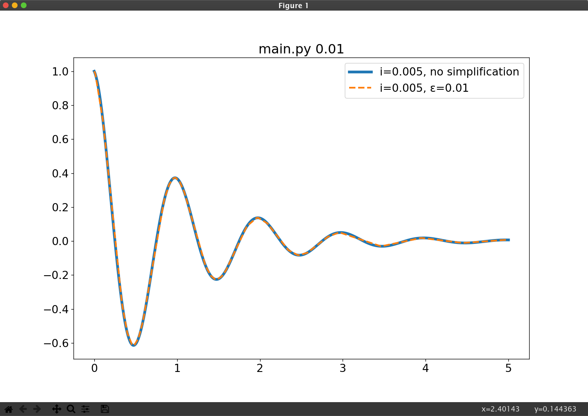
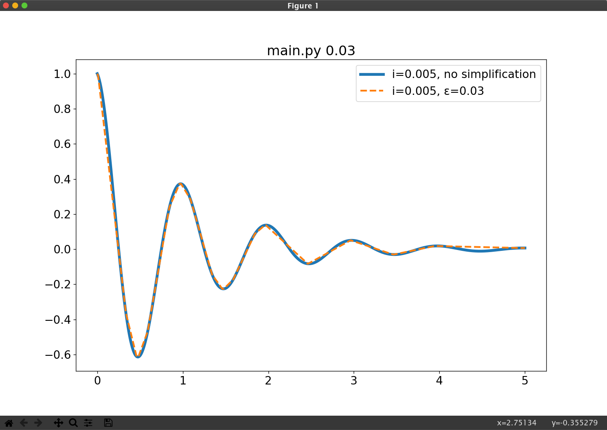
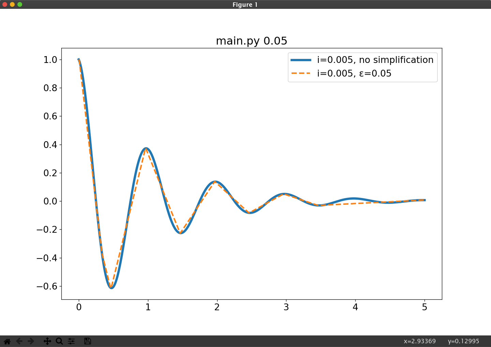
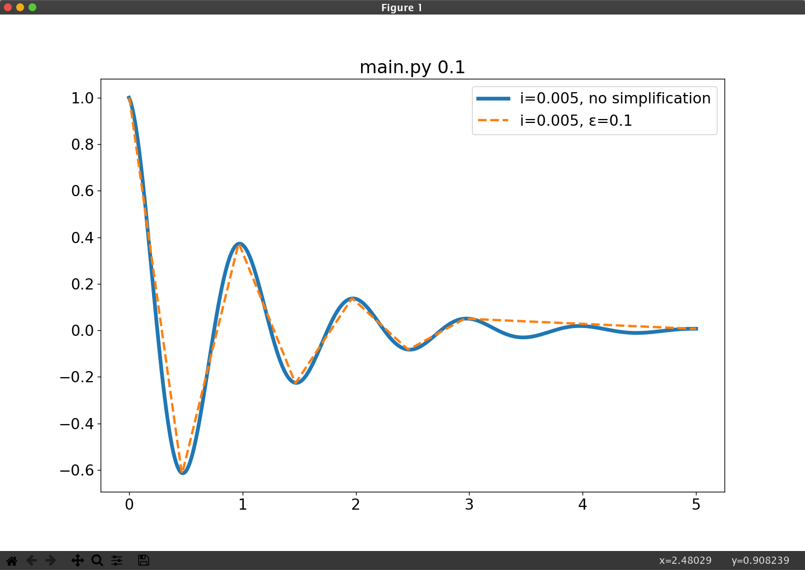
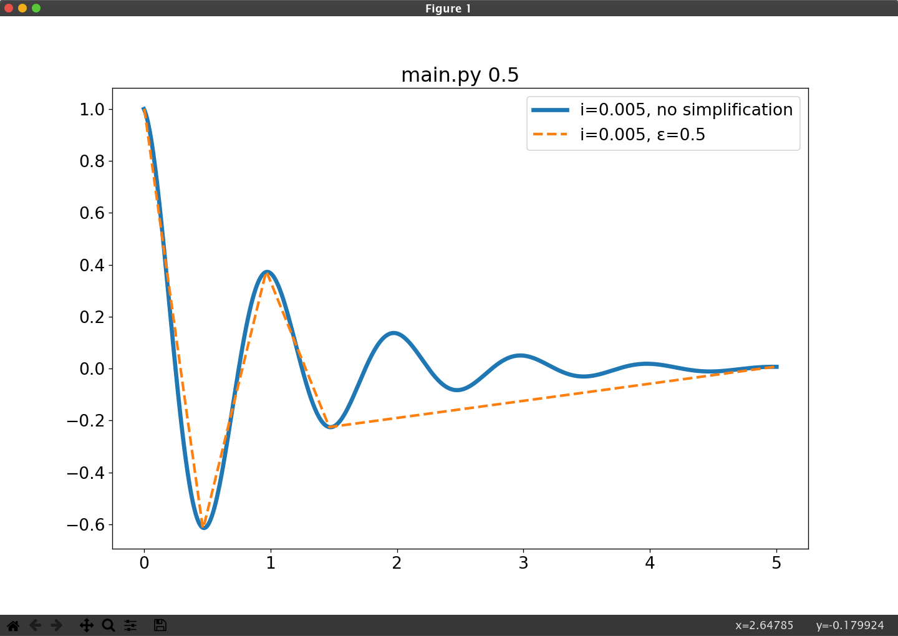

# RDP-Algorithm
A python &amp; matplotlib implementation of the Ramer-Douglas-Peucker algorithm

An implementation of the Ramer–Douglas–Peucker end-point fit algorithm
using python and matplotlib. This is implemented according to the
algorithm described on the wikipedia page for [Ramer-Douglas-Peucker algorithm](https://en.wikipedia.org/wiki/Ramer%E2%80%93Douglas%E2%80%93Peucker_algorithm)
and was inspired by the [Coding Train's Coding Challenge](https://www.youtube.com/watch?v=nSYw9GrakjY)
by Dan Shiffman

Pass values for epsilon in as arguments to the program.

## Examples

`python main.py 0.01`

`python main.py 0.03`

`python main.py 0.05`

`python main.py 0.1`

`python main.py 0.5`

